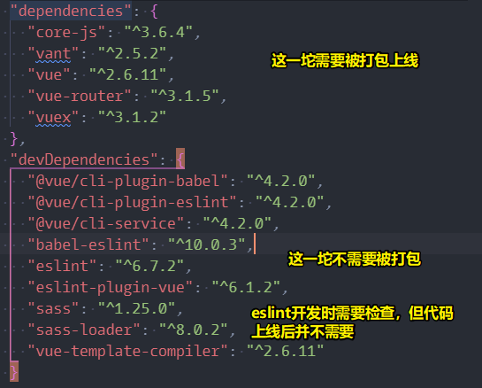
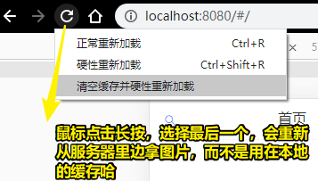
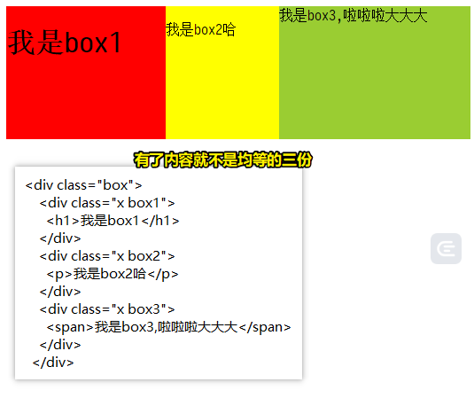
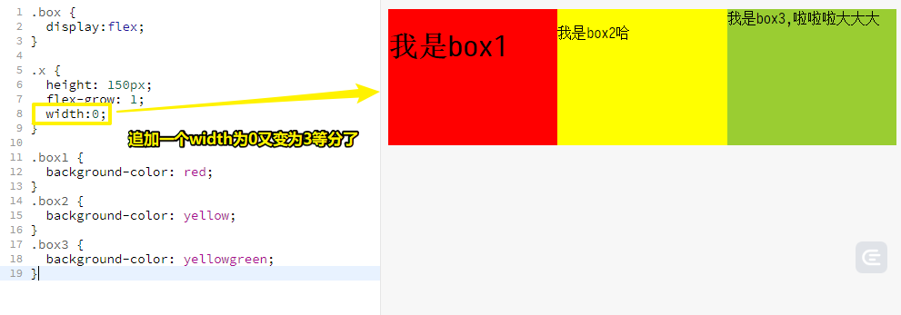

# 02-首页布局及 Vant

## ★Vant

### <mark>1）Vant使用</mark>

- [Vant - 轻量、可靠的移动端 Vue 组件库](https://youzan.github.io/vant/#/zh-CN/home)
- `yarn add vant` or `npm i vant -S`
- 导入所有组件
- 按需导入组件（推荐）`npm i babel-plugin-import -D`

### <mark>2）需求</mark>

1. NavBar -> 不会因为滚动条往下走而看不见，而是一直杵在哪儿的
2. 轮播图 -> touch触摸滚动
3. 热门商品 -> 电商网站里边常有的模块 -> 滚一下滑动三个商品
4. 推荐商品 -> 类似「猜你喜欢」，像淘宝、京东这样的大型网站，都会经过大数据来分析你的操作习惯和行为，从而推送一些你感兴趣，对你有用的信息

### <mark>3）为啥用组件库？</mark>

很多公司都会有个叫组件组的组，顾名思义，这是造轮子的，它们会把造好的轮子供给其它开发组使用，以此来加快开发效率，毕竟有些东西不需要重头开始写的哈！而市面上存在一些人家开源的组件库，以供广大开发者使用，我们站在巨人的肩膀上，即使用他们开源的组件库，来增加自己的开发效率，从而让自己更多关注与业务需求上！

### <mark>4）为啥用Vant这个组件库？</mark>

市面上有很多UI组件库，为啥要用它的呢？

因为Vant它是：

- 基于Vue的
- 基于移动端的
- 对移动端电商网站支持得很好，如有优惠卷、地址、购物车卡片、省市区、产品导航等这样的组件
- 测试覆盖率90%以上，可见代码质量是过关的！

### <mark>5）推荐几个其它的组件库？</mark>

> 学会使用一个组件库之后，那么学其它组件库，那就是 so easy了

#### 1、推荐的UI组件库？

- vux：[VUX - Vue 移动端 UI 组件库](https://vux.li/)
- element：[Element - 网站快速成型工具](https://element.eleme.cn/#/zh-CN)，基于 Vue 2.0 的**桌面端**组件库
- iView：[iView - 一套高质量的UI组件库](http://v1.iviewui.com/)，那我们做的这个农机商城来说，界面是给买家用的，而卖家呢？显然需要一个管理系统，即用于管理店铺、商品信息上传、介绍什么的，总之，一个完整的项目，肯定会有个管理系统的，当然，界面UI要求没有那么高。总之，其生态好
- iview-admin：[iview/iview-admin: Vue 2.0 admin management system template based on iView](https://github.com/iview/iview-admin)，老师之前做项目的时候有用过，而且觉得特别好用
- Muse：[Muse-UI](https://muse-ui.org/#/zh-CN)，好看，简洁

每个技术生态，都会有相应的组件库，如React 也有基于React 的组件库

总之，不管怎样，只要你会一个，那么其它的都很容易上手！

#### 2、什么叫i18n？

什么叫国际化？如果我们的项目不仅要支持中文，还得支持英文等，那么我们的页面顶部就会有一个切换语言的菜单，而vue就有个叫i18n的国际化插件——[介绍 - Vue I18n](https://kazupon.github.io/vue-i18n/zh/introduction.html) 来做这件事！

### <mark>6）接触一项新的技术，该如何去学呢？如学习对Vant的使用</mark>

> 问题如何分析，以及如何解决

#### 1、CRM大法


#### 2、项目分为开发环境和生产环境？

在webpack里边，是有开发模式和生产模式之说的，而根据不同的模式，webpack会有不同的打包规则！

本地写项目，即为开发环境

项目打包上线，需要把无用的代码去掉，如注释等，这样我们上线的项目才比较小！而这为生产环境

dependencies：生产环境、开发环境都会用到的包 

devDependencies：只在开发环境使用的包，`--save-dev or -D`（npm） or `--dev`（yarn）



#### 3、导入所有组件？

main.js是主文件，往该文件里边导入东西，所有文件都能使用，毕竟该文件是第一个被浏览器执行的！

``` js
import Vue from 'vue';
import Vant from 'vant';
import 'vant/lib/index.css';

Vue.use(Vant);
```

> `import Vant from 'vant';`的`vant`这个名字，肯定是与依赖里边的 `"vant": "^2.5.2"`的`vant`相对应着的！

> 关于import的先后顺序，如果A需要依赖B，那么B先import，A后引入，如上边的，vant依赖vue，所以vue先引入

> `import 'vant/lib/index.css';`，不用from是因为我们用不到变量，index.css这个文件在node_modules目录下的vant目录下的lib目录

使用（在单文件文件里边的template中直接使用就好了）：

``` html
<van-button type="default">默认按钮</van-button>
```

> 一般来说，每一个自定义组件标签的都会以组件库的名字，然后加 `-`开头来命名

这种方式，是导入vant旗下所有的组件，这意味着我们没有使用到的组件都会被打包上线！

所以这会导致打包出来的文件体积巨大，存在大量冗余的代码！

因此，不推荐这种方式来引入，而是推荐「按需引入」

#### 4、按需引入组件？（推荐）

> 用到哪个组件，就引入哪个，用不到的就不引入！

保证了打包上线的代码体积更小！

安装插件：

``` bash
yarn add -D babel-plugin-import
# or
npm i babel-plugin-import -D
```

在 `babel.config.js` 里边添加以下代码：

``` js
module.exports = {
  plugins: [
    ['import', {
      libraryName: 'vant',
      libraryDirectory: 'es',
      style: true
    }, 'vant']
]
};
```

使用Button、Icon组件：

``` js
// main.js
// 按需引入组件
import { Icon, Button } from "vant";
// 可链式注册组件
Vue.use(Icon).use(Button);
```

``` html
<!-- src/views/Home.vue -->
<template>
  <div class="home">
    首页
    <van-button type="default">默认按钮</van-button>
    <van-button type="primary">主要按钮</van-button>
    <van-icon name="chat-o" />
  </div>
</template>
```

效果：


## ★首页布局

- 页头 NavBar
- 页脚 Tabbar
- 录播图 Swipe 懒加载 V-lazy
- 热门商品 vue-awesome-swiper
- 推荐商品

### <mark>1）NavBar</mark>

CRM大法，注意slot的用法

### <mark>2）Tabbar</mark>

注意双向绑定，查看哪个Tab被点击了

### <mark>3）Swipe</mark>

轮播的图片数据不是写死的！

如果没有后端配合 -> 那么会用mock来模拟数字的随机数！

轮播的图片 -> UI给的图片，其大小肯定是一致的 -> 如果没有图片，随便到网上找几张相关的图，如果大小不一，自己设定样式

➹：[Searching farmer FREE stock photos - picjumbo](https://picjumbo.com/search/farmer)

轮播 -> v-for -> `:key`（必须添加，虚拟DOM，性能好点） -> data -> `xxx:[{},{},……,{}]`，元素是对象，毕竟图片有url、name等信息

一个不要缓存的请求技巧：



图片处理其实很麻烦 -> 毕竟图片需要加载，而且如果图片过大，会加载很慢 -> 所以有图片的懒加载和预加载

假如有100张需要被轮播图片，当用户只看了1、2张图片，那么用户打开首页的时候，需要去请求100张图片吗？

显然不需要哈，不然，网络请求、服务器就鸭梨山大了

处理方案：图片的懒加载

vant的原理：每次只加载2张图片，如进来首页，加载1、2图片，用户滑到第二张或者定时自动走到第二张就会加载3图片，同理……滚到3，就会加载4……

> 用了v-lazy这个指令后，就不用写src属性了

注：如果引入本地图片，需要用require，如 `require("../assets/images/img1-1080x720.jpg")`

### <mark>4）vant提供的样式是px单位的？</mark>

> 之前我们自己引入rem.js做的适配只能适用于我们自己写的，而且需要自己改为rem单位

安装：

``` bash
# 是一款 postcss 插件，用于将单位转化为 rem
yarn add -D postcss-pxtorem
# 用于设置 rem 基准值，打包后还要使用
yarn add amfe-flexible

# or

npm install postcss-pxtorem --save-dev
npm i -S amfe-flexible
```

配置：

``` js
// postcss.config.js
module.exports = {
  plugins: {
    autoprefixer: {
      overrideBrowserslist: [
        "Android 4.1",
        "iOS 7.1",
        "Chrome > 31",
        "ff > 31",
        "ie >= 8"
      ]
    },
    "postcss-pxtorem": {
      rootValue: 37.5,
      propList: ["*"],
      // 该项仅在使用 Circle 组件时需要
      // 原因参见 https://github.com/youzan/vant/issues/1948
      selectorBlackList: ["van-circle__layer"]
    }
  }
};

```

> rootValue这个配置项的数值？ -> 是转化px的基准值，即postcss它会根据这个37.5来把我们用px写的数值转化为rem的 -> 在写css时候设计图上文字大小多少像素就写多少像素，如16px你就写16px -> 原先我们分成6份，现在分成10份
> 
> flexible 在iPhone6设备设置的 html—>font-size 也为37.5px 。

使用：

``` js
// main.js
import "amfe-flexible/index.js";
```

➹：[Vant UI 框架 Rem 适配 750/640 分辨率设计稿 - M.M.F 小屋](https://www.mmxiaowu.com/article/5d22f477cc322a2843c51426)

### <mark>5）热门商品 vue-awesome-swiper</mark>

vue-awesome-swiper -> 帅气的swiper -> 到npm里边查找它如何使用，以及参数如何配置

文档：

- [Swiper API](https://swiperjs.com/api/#parameters)
- [surmon-china/vue-awesome-swiper: 🏆 Swiper component for @vuejs](https://github.com/surmon-china/vue-awesome-swiper#readme)

安装：

``` bash
yarn add vue-awesome-swiper
```

> mount：挂载之意

该组件可：

- mount with global -> main.js
- mount with component -> 单文件组件（选择这个，因为只有在这个页面里边会被用到，所以没有必要用全局）

使用组件：

``` js
import 'swiper/dist/css/swiper.css'

import { swiper, swiperSlide } from 'vue-awesome-swiper'

export default {
  components: {
    swiper,
    swiperSlide
  }
}
```

> vue-awesome-swiper旗下有很多属性，我们只要swiper 和 swiperSlide这两个属性，所以加个 `{}`解构了，然后注册为局部组件

老师的数据来源 -> 用python去爬的真实数据

> `:key` -> 方便建立虚拟DOM

### <mark>6）弹性盒模型之均等分</mark>

三等分：


然而，子盒子一般都是有内容的，可有了内容，子盒子就不是均等的三份了：



对所有子盒子设定`width:0;`



### <mark>7）MVVM？</mark>

理解MVVM需要理解MVC

MVVM -> View（DOM）  -> ViewModel（vue实例，即vm实例） -> Model（data）

### <mark>8）轮播图的代码为啥要这样写？</mark>

因为组件库的文档就是这么写的，如果没有文档，谁也不知道该怎么写才会起作用哈！

所以，一定要学会看文档（不是所有参数都会被用上的，具体场景具体分析）


